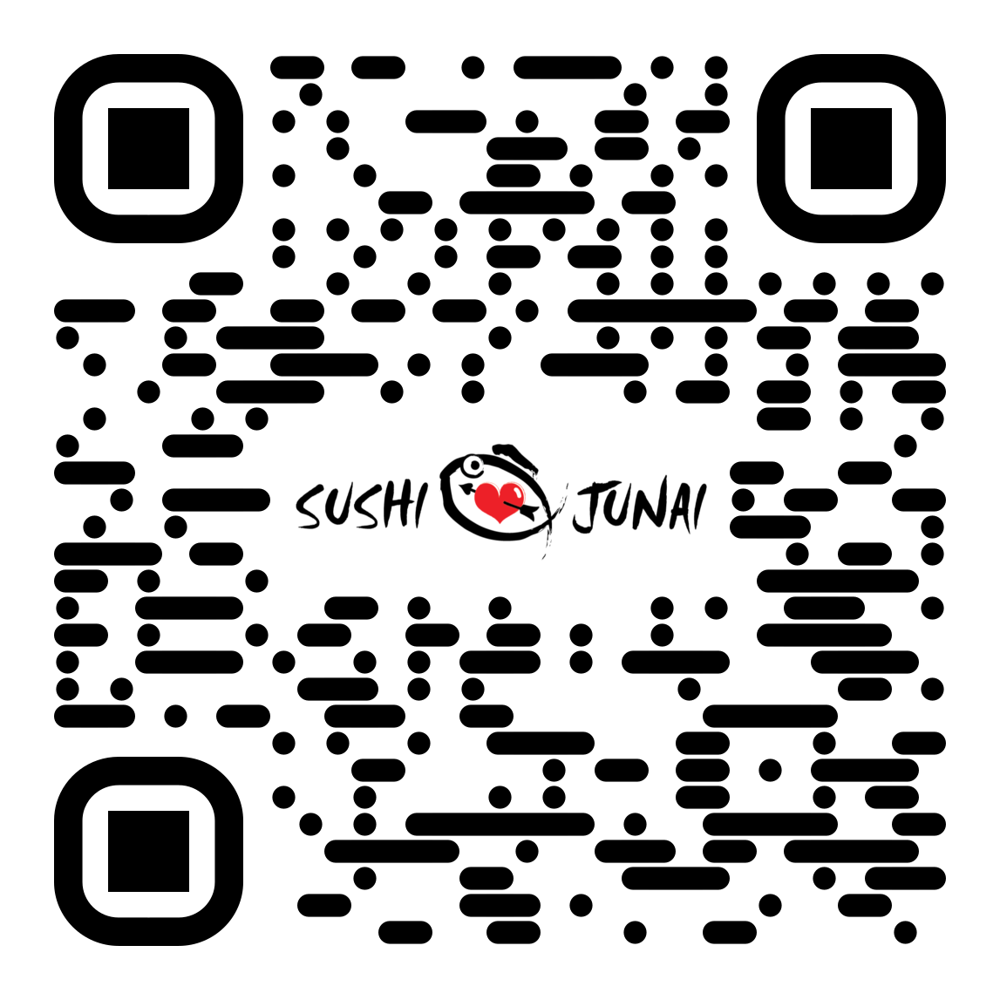

# Sushi Junai Official Website   
    This project was bootstrapped with Create React App.
    It uses the Yelp Fusion API
    
### Description
Official repo for Sushi Junai Restaurant website

## Table of contents
* [Description](#Description)
* [Version](#Version)
* [Deployed Project](#Deployed)
* [Features](#Features)
* [Installation](#Installation)
* [Usage](#Usage)
* [Test](#Test)
* [API](#API)
* [Technologies](#Technologies)
* [Motivation](#Motivation)
* [Contributors](#Contributors)
* [Questions](#Questions)
* [License](#License)

### Version 
4.1.6

### Deployed Project
    https://www.sushi-junai.app
    https://www.sushi-junai.app/dinein

### Features
* QR Code access
* dietary filters
* counter
* tip calculator
* cost calculator
* shopping cart feature

### API Reference
Yelp

### Technologies
* React
* Redux
* Node.JS
* EmailJS
* Reactstrap

### Motivation
Staci used to be a general manager at Sushi Junai for about two years. On the job, she noticed a lot of the customers came to the wait staff with the same questions and concerns. To alleviate some of these issues, Staci with 4 other colleagues of Coding Bootcamp, created a interactive Sushi Junai Web App.

## Author
* Staci Shon  

## Contributors
* Christina Kerr  

* Raunel Suarez-Magana  

* Aminadab Morales  

## Questions
Ask me anything:  

## License
MIT © Sushi Junai
